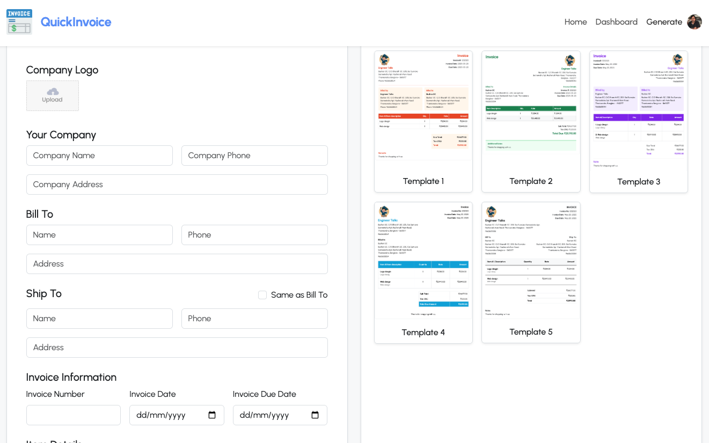
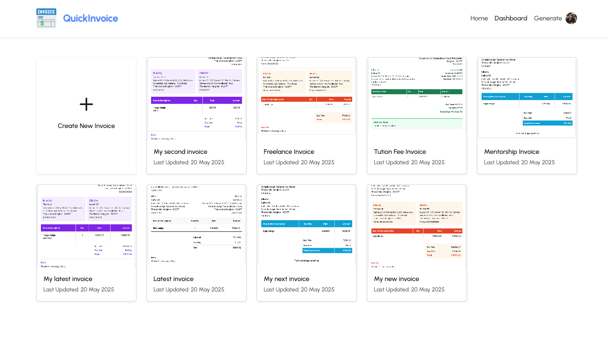
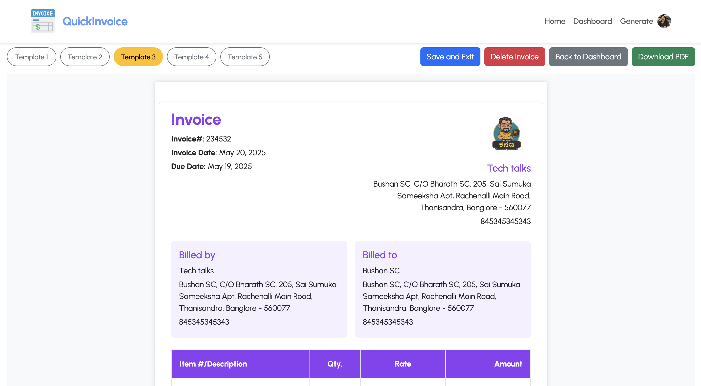
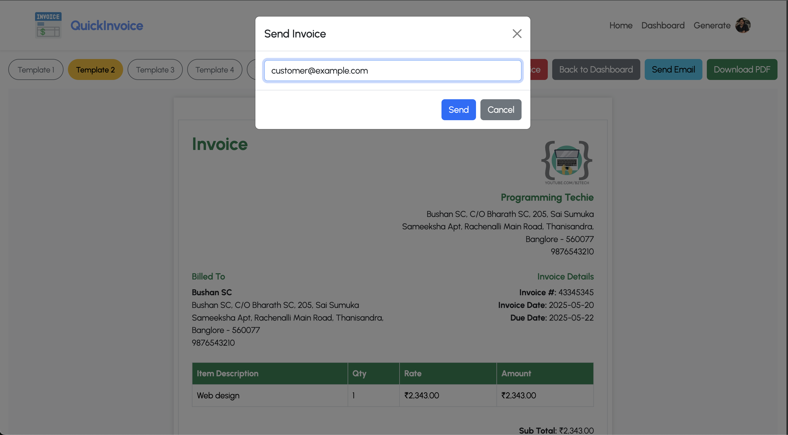

# InvoiceX 🚀

[](https://opensource.org/licenses/MIT)

InvoiceX is a full-stack application that allows users to create, manage, and send invoices effortlessly. It features a Spring Boot backend with MongoDB and a React frontend with Bootstrap.

## ✨ Features

- **User Authentication:** Secure sign-up and sign-in functionality using Clerk.
- **Invoice Management:** Create, view, and delete invoices.
- **Dashboard:** A central place to see all your invoices at a glance.
- **Multiple Templates:** Choose from a variety of templates to create professional-looking invoices.
- **Live Preview:** See how your invoice looks in real-time as you're creating it.
- **PDF Download:** Download your invoices as PDFs.
- **Send by Email:** Email invoices directly to your clients.

## 🛠️ Tech Stack

### Backend

- **Java:** The primary programming language.
- **Spring Boot:** The framework for building the backend.
- **MongoDB:** The database for storing invoice and user data.
- **Clerk:** For user authentication and management.

### Frontend

- **React:** The library for building the user interface.
- **Bootstrap:** The CSS framework for styling the application.
- **React Router:** For handling routing within the application.
- **Clerk React:** For integrating Clerk authentication in the React app.
- **html2canvas & jsPDF:** For converting invoices to PDF.

## 🚀 Getting Started

### Prerequisites

- Java 21 or later
- Maven
- Node.js and npm
- MongoDB instance

### Installation & Setup

1.  **Clone the repository:**
    ```bash
    git clone https://github.com/your-username/InvoiceX.git
    cd InvoiceX
    ```

2.  **Backend Setup:**
    - Navigate to the `backend` directory.
    - Create an `application.properties` file in `src/main/resources` and add your MongoDB and Clerk configuration:
      ```properties
      spring.data.mongodb.uri=mongodb://localhost:27017/invoicex
      clerk.api.key=YOUR_CLERK_API_KEY
      ```
    - Run the backend server:
      ```bash
      mvn spring-boot:run
      ```

3.  **Frontend Setup:**
    - Navigate to the `frontend` directory.
    - Create a `.env` file and add your Clerk publishable key:
      ```
      VITE_CLERK_PUBLISHABLE_KEY=YOUR_CLERK_PUBLISHABLE_KEY
      ```
    - Install the dependencies and start the frontend server:
      ```bash
      npm install
      npm run dev
      ```

## Screenshots

| Landing Page | Dashboard |
| :---: | :---: |
|  |  |
| **Invoice Form** | **Invoice Preview** |
|  |  |

## 🤝 Contributing

Contributions are welcome! Please feel free to submit a pull request.

## 📄 License

This project is licensed under the MIT License - see the [LICENSE](LICENSE) file for details.
